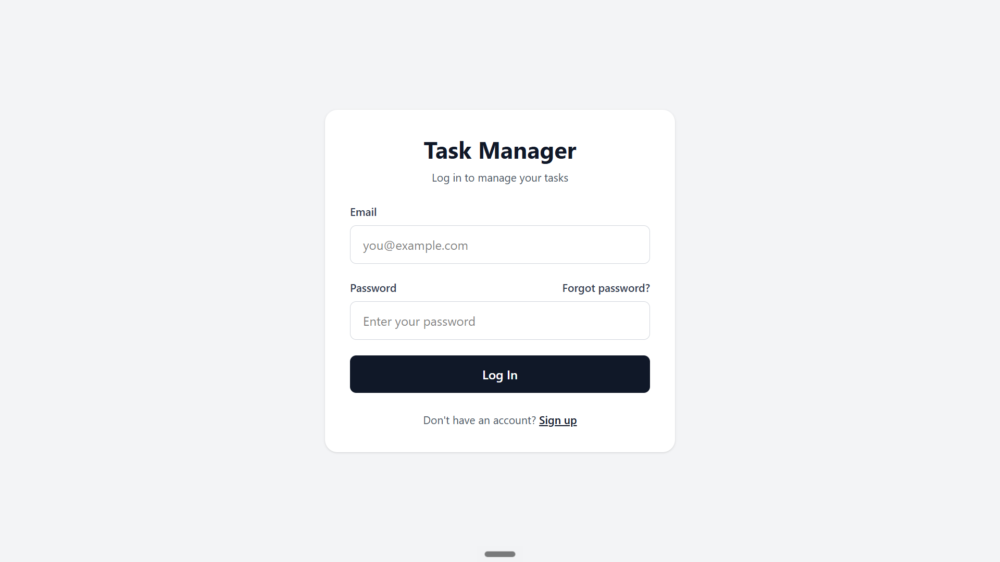
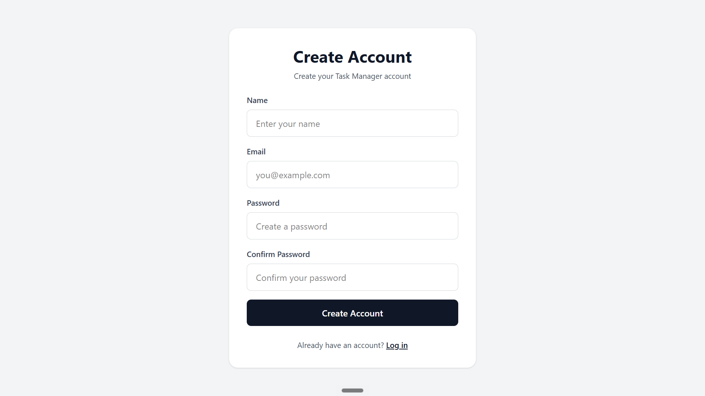
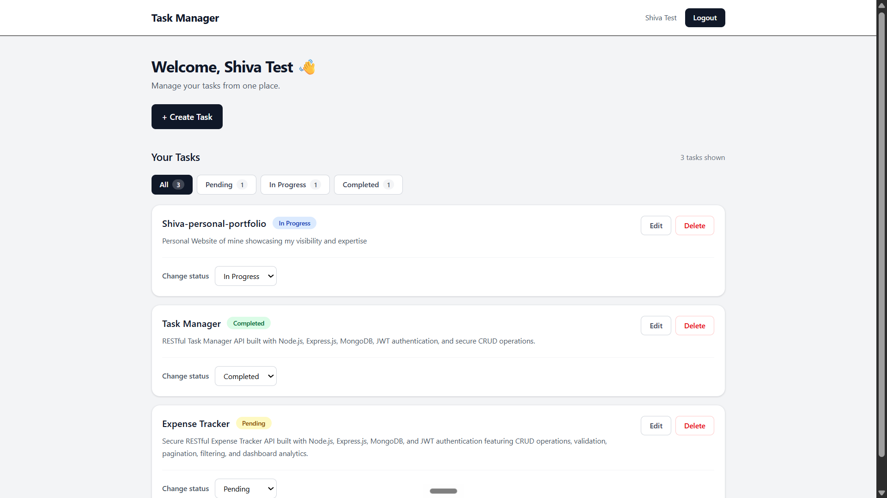
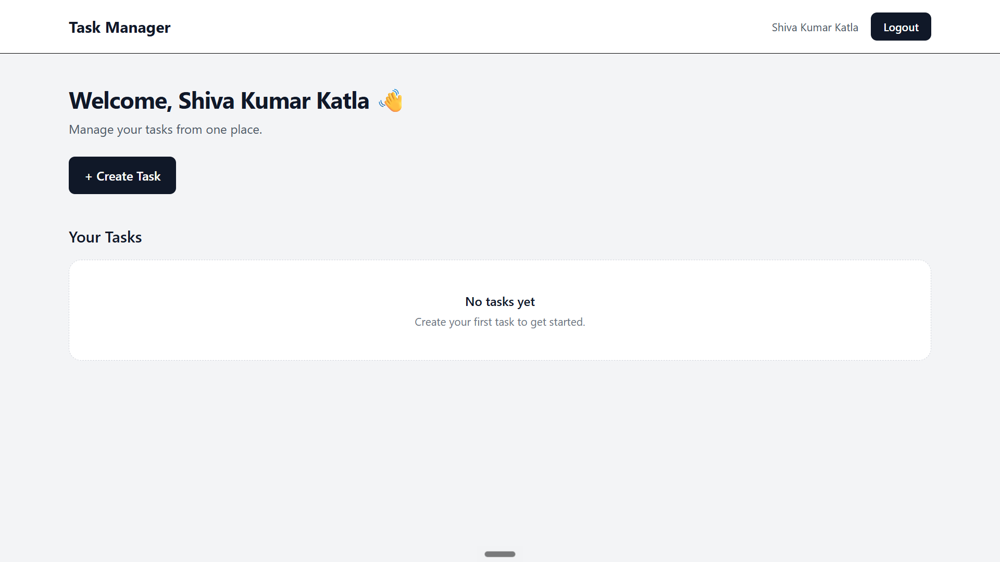
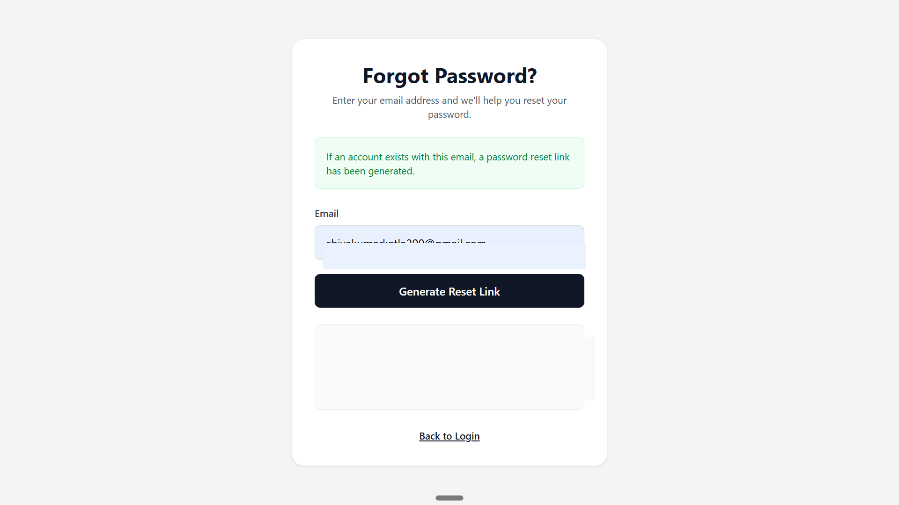
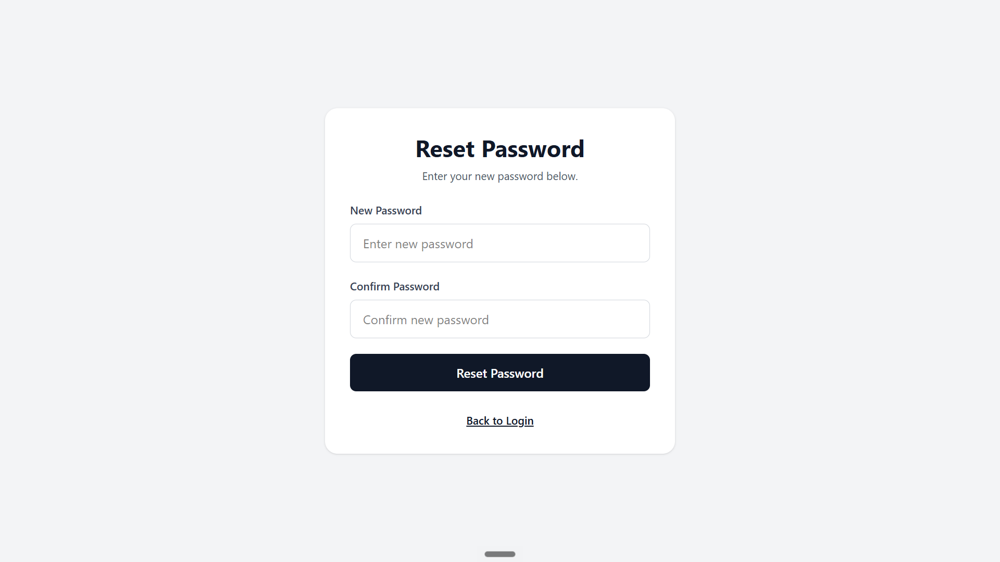

# Task Manager

A full-stack task management application with JWT authentication, protected routes, task CRUD operations, task status management, and password recovery.

## Live Demo

**Frontend:** https://task-manager-frontend-rouge-omega.vercel.app/

**Backend API:** https://task-manager-api-shi8.onrender.com/

**Source Code:** https://github.com/shivakumarkatla/task-manager-frontend

## Features

- User registration and login
- JWT-based authentication
- Persistent authentication across page refreshes
- Protected dashboard routes
- Create, read, update, and delete tasks
- Task status management:
  - Pending
  - In Progress
  - Completed
- Task filtering by status
- Forgot password flow
- Password reset using a secure reset token
- Form validation and error handling
- Logout functionality
- Responsive frontend UI
- REST API integration between frontend and backend

## Tech Stack

### Frontend
- React
- React Router
- Axios
- Tailwind CSS
- Vite

### Backend
- Node.js
- Express.js
- MongoDB
- Mongoose
- JWT
- bcrypt
- dotenv

### Deployment
- Vercel — Frontend
- Render — Backend API
- MongoDB — Database

## Screenshots

### Login



### Sign Up



### Dashboard



### Dashboard — Empty State



### Forgot Password



### Reset Password



## Authentication Flow

1. A user creates an account through the Sign Up page.
2. The backend validates the request and creates the user.
3. The user logs in with their email and password.
4. The backend returns a JWT.
5. The frontend stores the token and attaches it to authenticated API requests.
6. Protected routes allow authenticated users to access their dashboard and tasks.
7. Users can request a password reset through the Forgot Password flow.
8. A reset token is used to set a new password.

## API

The frontend communicates with the deployed REST API through:

`https://task-manager-api-shi8.onrender.com/api`

Main authentication endpoints include:

- `POST /api/auth/register`
- `POST /api/auth/login`
- Password recovery and reset endpoints

Task endpoints provide authenticated CRUD operations and task status updates.

## Local Setup

### 1. Clone the repository

```bash
git clone https://github.com/shivakumarkatla/task-manager-frontend.git
cd task-manager-frontend
```

### 2. Install dependencies

```bash
npm install
```

### 3. Configure the API URL

Update the Axios base URL in:

```text
src/api/axios.js
```

For local development, point it to your locally running backend API.

### 4. Start the development server

```bash
npm run dev
```

## Project Structure

```text
src/
├── api/
│   └── axios.js
├── components/
├── context/
│   └── AuthContext.jsx
├── pages/
│   ├── Login.jsx
│   ├── Register.jsx
│   ├── ForgotPassword.jsx
│   ├── ResetPassword.jsx
│   └── Dashboard.jsx
├── App.jsx
└── main.jsx
```

## Project Status

The application is deployed and the main authentication and task-management flows are working in the live version.

## Future Improvements

- Task due dates and reminders
- Search and advanced filtering
- Task priority management
- Pagination for larger task lists
- Improved dashboard analytics
- Automated frontend and backend tests

## Author

**Shiva Kumar Katla**

Built as a full-stack portfolio project to practice authentication, REST APIs, database integration, protected routes, and deployment.
